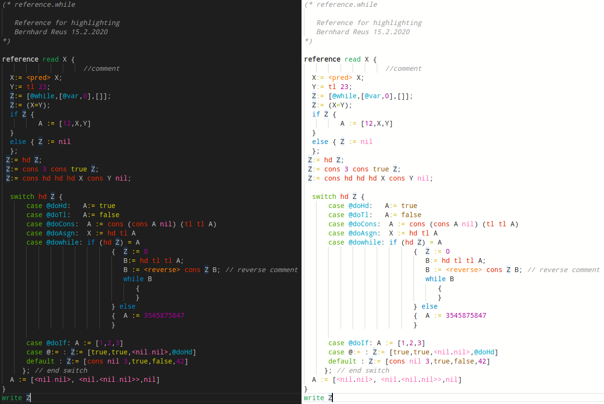
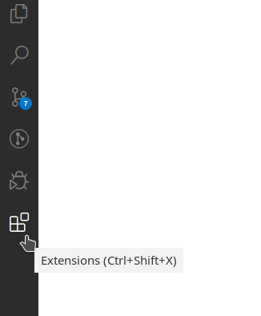
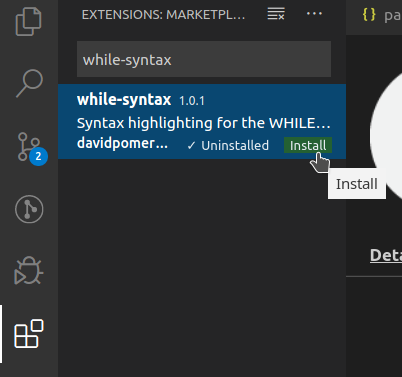
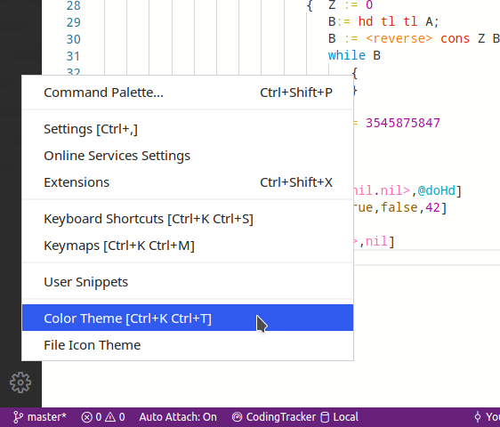
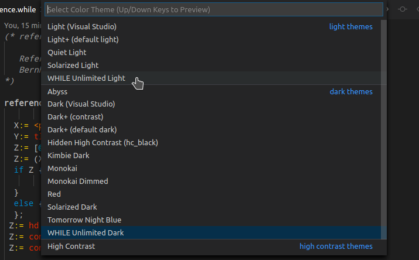
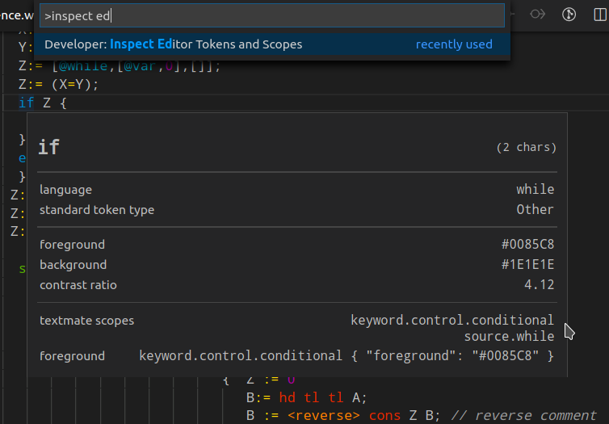

# WHILE Syntax Highlighting for VS Code

)

A [VS Code](https://code.visualstudio.com/) syntax highlighter for the [extended WHILE language](https://github.com/alexj136/HWhile "The hWHILE interpreter"), as used in the [Limits of Computation](https://www.sussex.ac.uk/study/modules/undergraduate/2020/G5029-limits-of-computation "About the module") module at the University of Sussex.

Uses the same colours as the [Sublime plugin](https://github.com/z5229221/WHILE-Syntax-Highlighter), by which it was inspired.

Consists of two parts:

- A syntax in the TextMate/JSON format. This enables existing themes, such as the default themes, to make sense of the language.

- Two custom themes for the WHILE language grammar. They are much cooler than the colours from the default themes, but they only support highlighting of `.while` files. [_Theme by Language_](https://marketplace.visualstudio.com/items?itemName=jsaulou.theme-by-language) is a nice and simple extension which solves this problem and selects the theme according to the current file extension. Otherwise you will need to switch the theme manually whenever you are working with WHILE.

## Preview

## Installation
1. Select the `Extensions` button in the sidebar.

2. Search for `while-syntax` and install the extension.

3. Select the `Settings` button in the lower sidebar.

4. Select the `While Unlimited Light` or `While Unlimited Dark` theme in the list.

## Contributing
All kinds of contributions are very welcome! :)

## Development

### Debugging
Clone this repository, open it in VS Code, and press `F5` to open a new VS Code window where all your changes are applied. Colour changes are live-updated automatically, and with `Ctrl` `Shift` `F5` you can reload the debugging window to apply grammar changes. 

Press `F1` and search for `Developer: Inspect Editor Tokens and Scope` to see how the grammar tokenizes each word.

### Resources
- [VS Code syntax highlighting guide](https://code.visualstudio.com/api/language-extensions/syntax-highlight-guide)
- Scope naming:
  - [Naming conventions for scopes in TextMate grammars](https://macromates.com/manual/en/language_grammars)
  - [Scope naming in Sublime](https://www.sublimetext.com/docs/3/scope_naming.html)
- [Onigurama Regex](https://github.com/kkos/oniguruma/blob/master/doc/RE)
- [Publishing VS Code extensions](https://code.visualstudio.com/api/working-with-extensions/publishing-extension)
